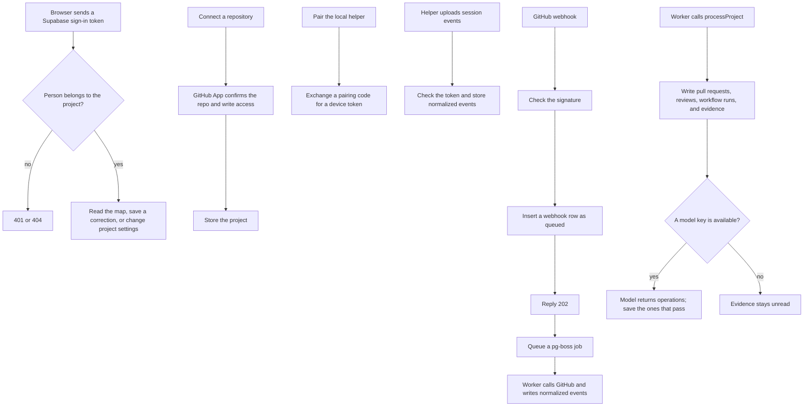

# API

This program accepts sign-in, repository connections, local session uploads, and GitHub webhooks. The browser reads the map from here. Map processing, storage, and other shared logic live in `packages/core`, which this server and the worker both use.

## Structure

## Files

- `package.json` declares the `@apm/api` package and its HTTP server.
- `tsconfig.json` points the TypeScript compiler at `src` and emits into `dist`.
- `src/index.ts` checks configuration and listens on this machine at port 4000.
- `src/app.ts` is the HTTP server: sign-in, connect a repository, pair a helper, upload events, receive webhooks, and mount the map and settings routes.
- `src/require-access.ts` is the middleware that checks project membership before a route runs.
- `src/auth.ts` checks a Supabase access token locally with the project's JWT secret and returns the signed-in user.
- `src/workspace-routes.ts` serves the settings HTTP routes for members, invitations, devices, and layout.
- `src/graph/routes.ts` serves the map, a work item, a feature, and a correction.

The files that used to live beside these routes — the database pool, stored events, the webhook job queue, membership, model keys, and map processing — are in `packages/core`.
