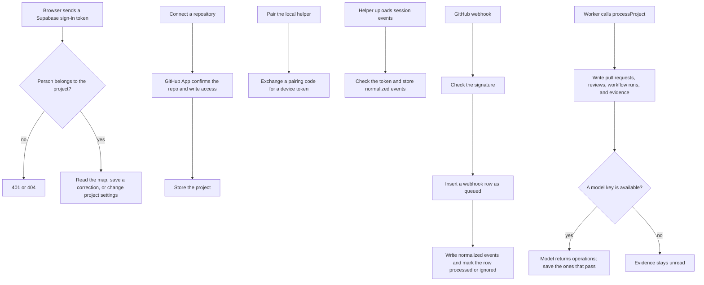

# API

This program accepts sign-in, repository connections, local session uploads, and GitHub webhooks, and it stores them in Postgres. The browser reads the map from here. The worker calls the functions in this package that turn stored events into map data.

## Structure

## Files

- `package.json` declares the `@apm/api` package, its HTTP server, and the functions the worker is allowed to import.
- `tsconfig.json` points the TypeScript compiler at `src` and emits into `dist`.
- `src/index.ts` loads the environment, requires a webhook secret, and listens on this machine at port 4000.
- `src/app.ts` is the HTTP server: sign-in, connect a repository, pair a helper, upload events, receive webhooks, and mount the map and settings routes.
- `src/env.ts` reads the repo’s `.env` file into the process environment.
- `src/db.ts` opens one shared Postgres connection pool.
- `src/auth.ts` checks a Supabase access token and returns the signed-in user.
- `src/store.ts` stores projects, inserts events, and finishes queued webhook deliveries.
- `src/ingest-events.ts` checks an uploaded batch and stores the session events that pass.
- `src/collector-tokens.ts` creates a pairing code, exchanges it for a device token, and revokes that token.
- `src/workspace.ts` stores members, invitations, settings, and the saved map layout.
- `src/workspace-routes.ts` serves the settings HTTP routes for members, invitations, devices, and layout.
- `src/demo/seed-demo.ts` fills a local database with a demo project and runs it through map processing.
- `src/graph/routes.ts` serves the map, a work item, a feature, and a correction.
- `src/graph/graph-read.ts` reads the current map, one work item, one feature, and whether analysis is still pending.
- `src/graph/graph-store.ts` locks a project, records the changes from one run, and commits them at a new revision.
- `src/graph/process.ts` applies pending facts, then calls the model on ready evidence for one project.
- `src/graph/facts.ts` turns pending events into pull requests, reviews, workflow runs, and evidence without calling a model.
- `src/graph/evidence.ts` builds the text rows the model reads and skips a session line that was already stored.
- `src/graph/context.ts` builds the prompt for one model call from unread evidence, the current map, and a short reminder of older session text.
- `src/graph/proposal.ts` defines the operations the model is allowed to return.
- `src/graph/apply.ts` checks each operation and writes the ones that name records the model was shown.
- `src/graph/corrections.ts` applies a person’s edit to a feature or work item and records it as a correction.
- `src/graph/state.ts` computes a work item’s state from its pull requests.
- `src/graph/artifact-state.ts` defines the stored shape of a pull request and a workflow run.
- `src/graph/openai-interpreter.ts` sends the prompt to OpenAI and parses the operations that come back.
- `src/graph/eval-grouping.ts` runs saved session fixtures through the model and prints how the grouping came out.
