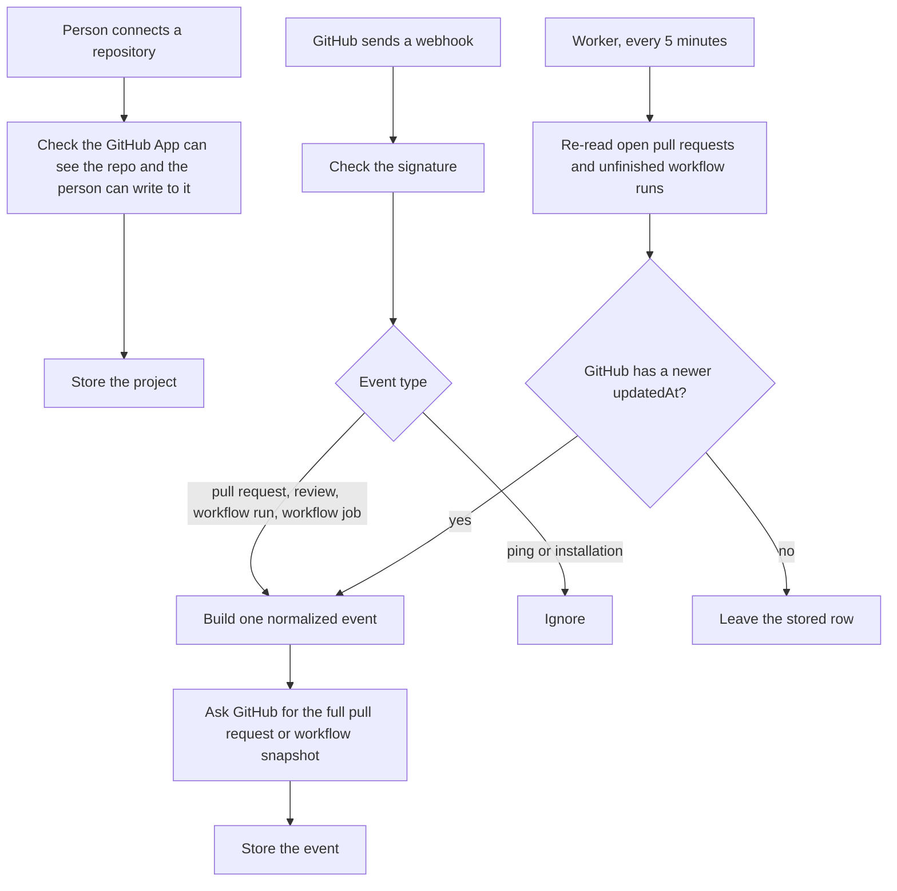

# GitHub collector

This package turns a connected repository, a GitHub webhook, and a later refresh into stored events. The API and the worker call these functions. Nothing in this folder runs on its own.

## Structure

## Files

- `package.json` declares the `@apm/github-collector` package and exports `access`, `github-client`, `webhook`, `enrich`, and `refresh`.
- `tsconfig.json` points the TypeScript compiler at `src` and emits into `dist`.
- `src/github-client.ts` signs the GitHub App JWT, requests an installation token, and calls the GitHub API with a timeout.
- `src/access.ts` checks that the repository id matches and the signed-in person has write access.
- `src/webhook.ts` checks the webhook signature and turns a pull request, review, workflow run, or workflow job into one normalized event.
- `src/enrich.ts` calls GitHub for the pull request’s commits and files, or a workflow run’s jobs, and attaches that snapshot to the event.
- `src/refresh.ts` re-reads up to 50 open pull requests from the last 30 days and 50 unfinished workflow runs from the last 24 hours, and writes a new event only when GitHub’s `updatedAt` is newer.
