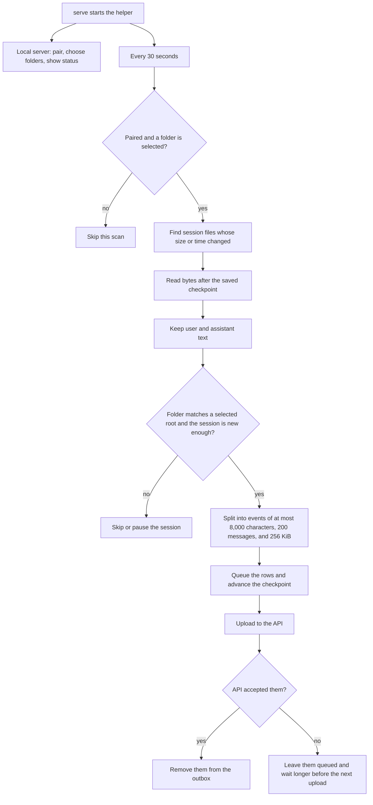

# Local collector

This program runs on your computer. About every 30 seconds it reads Codex, Claude Code, and Cursor logs for the paired project and uploads new session events to the API. GitHub is not involved.

## Structure

## Files

- `package.json` declares the `@apm/local-collector` package and its dependency on SQLite.
- `tsconfig.json` points the TypeScript compiler at `src` and emits into `dist`.
- `src/index.ts` starts the command-line entry and exits with the command’s status code, except `serve`, which stays running.
- `src/cli.ts` either prints events for one log file or starts the local server and the 30-second loop.
- `src/collector-loop.ts` scans and uploads about every 30 seconds, and waits longer after an upload failure.
- `src/local-server.ts` is the local API for pairing, folder selection, and helper status. The web app renders that page.
- `src/local-db.ts` stores pairing, selected folders, session checkpoints, and the upload outbox in SQLite.
- `src/collection-pass.ts` decides which discovered sessions are eligible, writes their events into the outbox, and advances the checkpoint with that queue.
- `src/find-sessions.ts` finds session files under an agent’s log directory and reads the ones that changed.
- `src/change-tracker.ts` remembers each log file’s size and modification time so an unchanged session is skipped.
- `src/read-after-offset.ts` reads only the bytes of a session log that come after the saved checkpoint.
- `src/log-bytes.ts` identifies a log file and finds the end of its last complete line.
- `src/log-walk.ts` walks a log directory so an adapter can list session files.
- `src/agents.ts` lists the Codex, Claude Code, and Cursor adapters the scan loops over.
- `src/contract/adapter.ts` defines where an agent’s logs live and how a session file is parsed.
- `src/contract/session.ts` defines the parsed session and one user or assistant message.
- `src/adapters/codex.ts` reads a Codex jsonl file and keeps user messages and assistant message text.
- `src/adapters/claude-code.ts` reads a Claude Code jsonl file and keeps lines whose type is `user` or `assistant`.
- `src/adapters/cursor.ts` reads a Cursor session directory and keeps transcript lines whose role is `user` or `assistant`.
- `src/message-text.ts` keeps written message text, drops hidden reasoning, and replaces tool calls with `[tool output omitted]`.
- `src/build-events.ts` turns new messages into `session.started` and `session.content_added` events. Each event stays within 8,000 characters, 200 messages, and 256 KiB.
- `src/upload-outbox.ts` sends queued events to the API and leaves failed uploads in the outbox for a later try.
- `src/parse-file.ts` reads one log file and prints the events it would produce. The 30-second scan does not use it.
