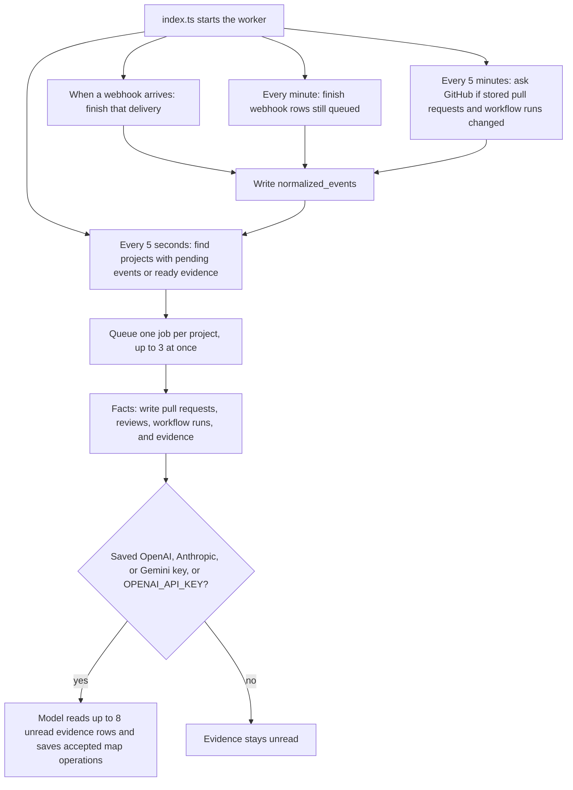

# Worker

The worker process reads Postgres and turns stored events into map data. It does not handle HTTP and it does not scan the local machine.

## Structure

## Files

- `package.json` declares the `@apm/worker` package, its run scripts, and its dependency on `pg-boss`.
- `tsconfig.json` points the TypeScript compiler at `src` and emits into `dist`.
- `src/index.ts` checks configuration, connects to Postgres and GitHub, and starts the worker until the process is stopped. Map processing comes from `packages/core`.
- `src/worker.ts` runs a saved webhook as soon as the API queues it, schedules the minute and five-minute loops, and runs facts, then model interpretation, for each due project.
